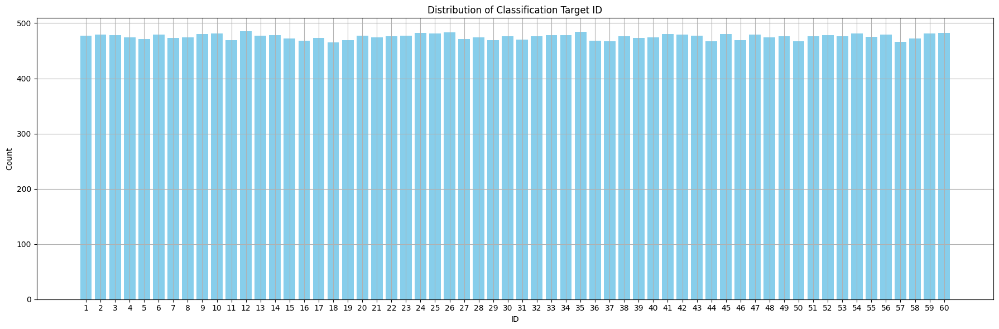
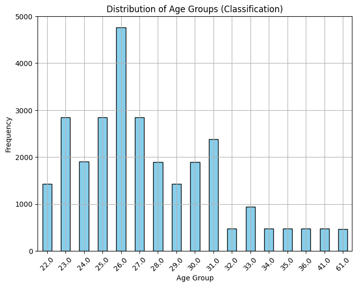
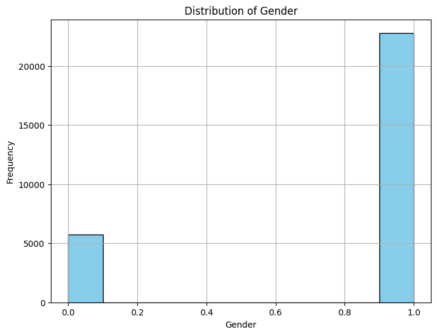
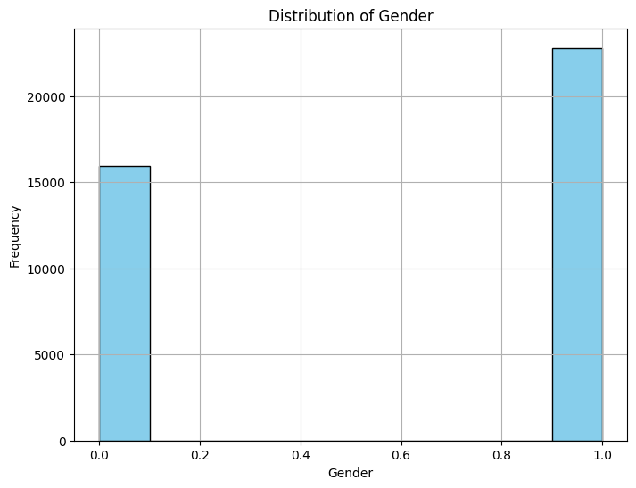
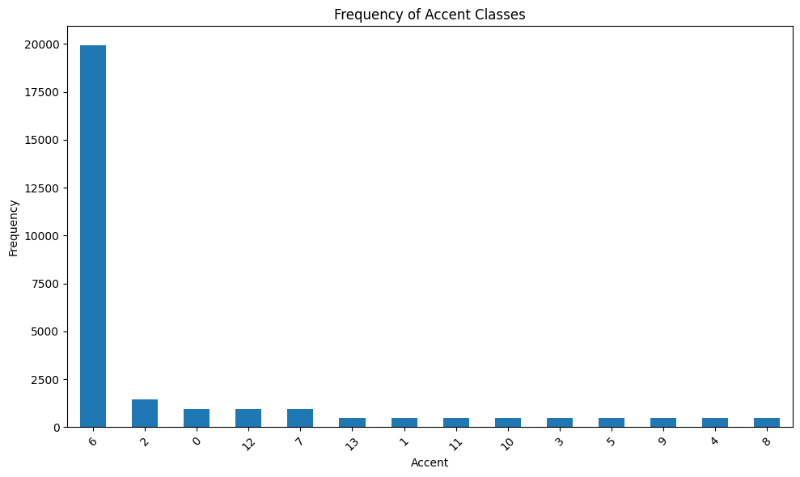
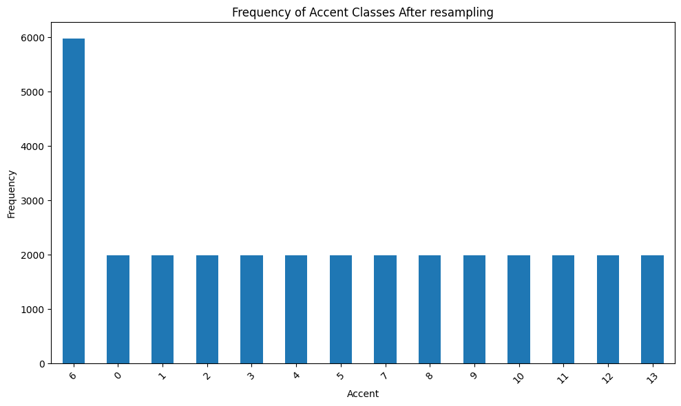

# AudioMNIST-Classifier

First we have to check whether there are any higher level of correlation between individual features and delete one exists. 
Highly correlated features can lead to model instability. Small changes in the input data can result in significant variations in the model's predictions, making it less reliable and interpretable and it can lead to overfitting too.

## Layer 7

Fortunately our dataset does not have any highly correlated features.

### Label 1 (ID)

[Open Colab Notebook for Label 1](https://colab.research.google.com/drive/1BGVRwHwts8e87tUGaYpUS48ure1_FiSI?usp=sharing)

Visualize the distribution of the data for each class of the target output ID.

There are 60 classes and dataset is almost equally distributed among them.

#### Logistic Regression

Since we do not know much about the dataset, we will first build a simple model, Logistic Regression Classifier with all the features and consider it as a baseline model to build different model with different feature set.

> Accuracy with all the features for Logistic regression classifier: 97.33%

We will use this as the baseline model.

#### Random Forest

> Accuracy with all the features for Random Forest Classifier: 90.66%

We will not use Random Forest as it gives lower accuracy than the baseline model.

#### Support Vector Machine

In Support Vector Machines (SVM), we can use different kernels, including the Polynomial Kernel, Radial Basis Function (RBF) Kernel, Linear Kernel and Sigmoid Kernel, by specifying the desired kernel. 

> Accuracy with all the features for SVM with RBF: 95.33%

> Accuracy with all the features for SVM with linear: 97.47%

> Accuracy with all the features for SVM with sigmoid: 89.73%

The combination of high accuracy scores for both the RBF and linear kernels indicates that the data may have both linear and non-linear components.

> Accuracy for poly kernel SVM (degree: 2) with all features: 95.60%

> Accuracy for poly kernel SVM (degree: 3) with all features: 96.67%

> Accuracy for poly kernel SVM (degree: 4-6) with all features: 97.20% 

> Accuracy for poly kernel SVM (degree: 7) with all features: 97.07%

> Accuracy for poly kernel SVM (degree: 8,9) with all features: 96.80%

The improvement in accuracy with increasing polynomial degrees suggests that there are non-linear patterns in the data that higher-degree polynomials can capture.

The data appears to have both linear and non-linear components.

The polynomial kernel, particularly with degrees 4, 5, and 6, appears to be effective at capturing the non-linear relationships in the data, achieving high accuracy while SVM with linear kernel also captures the highest accuracy by capturing the linearity between the features and the target.

#### XGBoost

XGBoost is often a superior choice for multi-class classification compared to Support Vector Machine (SVM) due to its ability to handle complex non-linear relationships, ensemble learning that reduces bias and variance, feature importance analysis, built-in regularization, scalability, robustness to missing data, and ease of hyperparameter tuning. XGBoost's effectiveness in addressing these challenges makes it a powerful and widely used algorithm in multi-class classification tasks, particularly for complex and high-dimensional datasets, offering both superior predictive performance and ease of use.

> Accuracy for XGBoost with all features: 90.93%

SVM outperforms the XGBoost. We can see the linear kernel gives the better accuracy than any other approach, therefore this linear seperability gives SVM the chance to outperform XGBoost.

#### Feature Elimination

- Create a Lasso Cross-Validation to get the optimal aplha for the Lasso Regression.
- Create Lasso Regression to select the features with non-zero coefficient.

Lasso regression is only able to reduce the features from 768 to 748.

After Feature Reduction:

> Accuracy for Logistic regression classifier with selected features: 96.93%

No significant change in the baseline model's accuracy after feature elimination.

> Accuracy for Random Forest Classifier with selected features: 89.73%

No Significant change in the RandomForest model's accuracy after feature elimination.

> Accuracy for SVM (RBF Kernel) for selected features: 95.47%

No Significant change in the SVM (RBF Kernel) model's accuracy after feature elimination.

> Accuracy for SVM (Linear Kernel) with selected features: 97.47%

The combination of high accuracy scores for both the RBF and linear kernels indicates that the data may have both linear and non-linear components.

> Accuracy for poly kernel SVM (degree: 2) with all features: 95.47%

> Accuracy for poly kernel SVM (degree: 3) with all features: 96.67%

> Accuracy for poly kernel SVM (degree: 4) with all features: 97.20%

> Accuracy for poly kernel SVM (degree: 5-8) with all features: 97.33% 

> Accuracy for poly kernel SVM (degree: 9) with all features: 96.67%

Overall, the dataset appears to have both linear and non-linear relationships between features and the target variable. The choice of the SVM kernel and polynomial degree significantly impacts model performance, with the RBF kernel and higher-degree polynomial kernels (degree 4 and above) performing particularly well.

> Accuracy for XGBoost with selected features: 91.20%

`SVM with Linear Kernel` outperforms all other models.

#### Final Approach

1. Eliminate the unimportant features with Lasso Regression.
2. Train and Evaluate the model trained with SVM (Linear Kernel).

### Label 2 (Age)

[Open Colab Notebook for Label 2](https://colab.research.google.com/drive/19dDbOJFTuG_b8sd0loF_ETCYiLhgWckb?usp=sharing)

Visualize the distribution of the data for each class of the target output Age. (Considering Age prediction as a classification task)

We have 17 different class of Age category.

Since we do not know much about the dataset, we will first build a simple model, Logistic Regression Classifier with all the features and consider it as a baseline model to build different model with different feature set.

- Build a baseline model (Logistic Regression Classifier)
- Use the baseline model to evalute and build different model.

#### Logistic Regression

> Accuracy with all features with Logistic Regression: 78.94%

We will use this model as the baseline model.

#### Random Forest
> Accuracy with all features with Random Forest Classifier: 78.26%

We will not use Random Forest as it gives slightly lower accuracy than the baseline model.

#### Support Vector Machine

In Support Vector Machines (SVM), we can use different kernels, including the Polynomial Kernel, Radial Basis Function (RBF) Kernel, Linear Kernel, and Sigmoid Kernel, by specifying the desired kernel. We will try all of them and see which gives the better accuracy.

> Accuracy with all the features for SVM with RBF: 91.85%

> Accuracy with all the features for SVM with linear: 85.46%

> Accuracy with all the features for SVM with sigmoid: 48.50%

> Accuracy with all features for SVM with poly kernel (polynimial: 2): 87.36%

> Accuracy with all features for SVM with poly kernel (polynimial: 3): 91.85%

> Accuracy with all features for SVM with poly kernel (polynimial: 4): 92.80%

> Accuracy with all features for SVM with poly kernel (polynimial: 5): 93.21%

> Accuracy with all features for SVM with poly kernel (polynimial: 6): 93.61%

> Accuracy with all features for SVM with poly kernel (polynimial: 7): 94.02%

> Accuracy with all features for SVM with poly kernel (polynimial: 8): 93.48%

> Accuracy with all features for SVM with poly kernel (polynimial: 9): 93.07%

Overall, the dataset appears to have both linear and non-linear relationships between features and the target variable. The choice of the SVM kernel and polynomial degree significantly impacts model performance, with the `RBF kernel` and `higher-degree polynomial` kernels (degree 4 and above) performing particularly well.

#### XGBoost

> Accuracy with all features for XGBoost: 87.90%

XGBoost performs better than our baseline model but no better than SVM models.

#### Feature Elimination

We will use Lasso Regression to eliminate the features associated with coefficients that are effectively reduced to zero by L1 regularization.

- We will Lasso Cross Validation to get the most optimal alpha value for the Lasso regression.
- Create the Lasso regression model and select only the important features.

Features are reduced from 768 to 745.

After Feature reduction:
> Accuracy with feature elimination in Logistic Regression: 78.94% 

There is no increase the performance after feature elimination for Logistic Regression.

> Accuracy with feature elimination in Random Forest: 78.53%

No significant increase in the performance after feature elimination for Random Forest Classifier.

> Accuracy with feature elimination for SVM with RBF: 92.255% 

A slight increase in the performance after feature elimination for SVM with RBF.

> Accuracy with feature elimination for SVM with linear: 85.46%

> Accuracy with feature elimination for SVM with poly kernel (polynimial: 2): 88.04%

> Accuracy with feature elimination for SVM with poly kernel (polynimial: 3): 91.03%

> Accuracy with feature elimination for SVM with poly kernel (polynimial: 4): 92.80%

> Accuracy with feature elimination for SVM with poly kernel (polynimial: 5): 93.34%

> Accuracy with feature elimination for SVM with poly kernel (polynimial: 6): 93.75%

> Accuracy with feature elimination for SVM with poly kernel (polynimial: 7): 93.61%

> Accuracy with feature elimination for SVM with poly kernel (polynimial: 8): 93.48%

> Accuracy with feature elimination for SVM with poly kernel (polynimial: 9): 92.225%

The accuracies of both Logistic Regression and RandomForest, while similar, are notably lower than the accuracies obtained with SVM models. This suggests that the dataset may not have clear, easily separable boundaries between classes, and the relationships between features and the target are not straightforwardly linear or trivial.

The SVM with the radial basis function (RBF) kernel achieved a significantly higher accuracy than Logistic Regression and RandomForest even better than SVM with the linear kernel. This indicates that the dataset likely contains intricate non-linear patterns, and the RBF kernel is well-suited to capture them.

Since SVM with linear kernel also gives a better performance the dataset is likely complex, with both linear and non-linear patterns contributing to the classification task.

#### Neural Network

A neural network with following layers was build to check its performance.

The neural network includes several hidden layers, each defined as follows:

These are fully connected (dense) layers. The units parameter specifies the number of neurons in the layer, and 'relu' stands for Rectified Linear Unit, which is a popular activation function.

The hidden layers are organized as follows:

- Hidden Layer 1: 1024 neurons with ReLU activation and a dropout layer with a dropout rate of 0.3 to prevent overfitting.
- Hidden Layer 2: 512 neurons with ReLU activation and a dropout rate of 0.2.
- Hidden Layer 3: 256 neurons with ReLU activation and a dropout rate of 0.2.
- Hidden Layer 4: 128 neurons with ReLU activation and a dropout rate of 0.2.
- Hidden Layer 5: 64 neurons with ReLU activation and a dropout rate of 0.1.

The output layer in the neural network has 17 neurons, which corresponds to a multi-class classification problem with 17 possible classes. The 'softmax' activation function is used to compute class probabilities for each of the 17 classes.

The 'adam' optimizer, popular optimization algorithm, used to update the model's weights during training.

> Accuracy with feature elimination for Neural Network : 81.66%

SVM outperforms the Neural Network I built. Some fine tuning is needed to make the NN to perform better. For NN to outperform other models, we need much more data than provided.

Anyway, we will use SVM for our final approach.

#### Final Approach

1. Eliminate features with Lasso Regression
2. Train & Evaluate the model in SVM with Polynomial kernel of 6th degree.

### Label 3 (Gender)

[Open Colab Notebook for Label 3](https://colab.research.google.com/drive/1WIUe-6-1JbgvMmUi0LDZB024jLDJy8fI?usp=sharing)

Visualize the distribution of the data for each class of the target output Gender.

Data is not sampled equally between both of the gender.

We can train the model with the given data without modification, and then oversample the data a bit and try to increase the accuracy.

Since we don't know much about the features, first we will build simple models as baseline.
 
- Can't use Naive Bayes because features have negative values too.
- Train and evaluate Logistic Regression model with all the features.
- Use it as the baseline model to build and evalute other models with different feature sets.

#### Logistic Regression

> Accuracy with all features and no sampling in Logistic Regression: 99.87%

Use the Logistic Regression Classifier model as the baseline model.

#### Random Forest
> Accuracy with all features and no sampling in Random Forest Classifier: 96.13%

Random Forest gives the accuracy below our baseline model, therefore we will neglect Random Forest.

#### Support Vector Machine

In Support Vector Machines (SVM), we can use different kernels, including the Polynomial Kernel, Radial Basis Function (RBF) Kernel, Linear Kernel, and Sigmoid Kernel, by specifying the desired kernel. We will try all of them and see which gives the better accuracy.

> Accuracy with all the features and no sampling for SVM with RBF kernel: 98.53%

> Accuracy with all the features and no sampling for SVM with linear kernel: 99.87%

> Accuracy with all the features and no sampling for SVM with sigmoid kernel: 93.47%

> Accuracy with all features and no sampling for SVM with poly kernel (polynimial: 2-7): 99.87%

> Accuracy with all features and no sampling for SVM with poly kernel (polynimial: 8,9): 100%

Out of all the SVM models, we got the 100% accuracy in Polynomial kernel with 8th degree. Higher-degree polynomials can represent more complex decision boundaries but lead to overfitting. It's better avoid the Polynomial kernel with the higher-degree model. 

The high accuracy scores across different SVM kernels (linear, RBF, sigmoid, and polynomial) suggest that the relationships between features and the target variable involve both linear and non-linear patterns. The SVM models are capable of capturing these patterns effectively. SVM models even outperform the XGBoost because of the this complexity.

#### XGBoost

> Accuracy with all features and no sampling for XGBoost: 99.20%

SVM outperforms XGBoost

#### Oversampling the dataset

Oversample the Gender "0". Don't oversample too much because it will overfit.

Now select a few models, re-train and evalute the accuracy.

#### Logistic Regression

> Accuracy with all features and no sampling in Logistic Regression: 99.87%

No change in accuracy even after sampling.

#### Random Forest
> Accuracy with all features and no sampling in Random Forest Classifier: 98%

Accuracy of the Random Forest increased from 96.13% to 98% after sampling. Therefore, sampling is helping to some extend to learn about the dataset.

#### Support Vector Machine

> Accuracy with all the features and oversampling for SVM with RBF kernel: 98.93%

> Accuracy with all the features and oversampling for SVM with linear kernel: 99.87%

> Accuracy with all features and oversampling for SVM with poly kernel (polynimial: 2-8): 99.87%

> Accuracy with all features and oversampling for SVM with poly kernel (polynimial: 9): 100 %

After sampling all of our SVM model performance increased a little.
Now we have the accuracy of 99.87% for the SVM model with Linear kernel.

#### XGBoost

> Accuracy with all features and oversampling for XGBoost: 99.20%

There is no improvement in performance of XGBoost model after sampling the dataset.

#### Feature Elimination

We will use Lasso Regression to eliminate the features associated with coefficients that are effectively reduced to zero by L1 regularization.

- We will Lasso Cross Validation to get the most optimal alpha value for the Lasso regression.
- Create the Lasso regression model and select only the important features.

Features are reduced from 768 to 364.

After Feature reduction:
> Accuracy with selected features for SVM with RBF kernel: 100%

> Accuracy with selected features for SVM with Linear kernel: 99.87%

Even though SVM with linear kernel doesn't show any improvement after feature elimination, SVM with RBF kernel performance increased to 100%. 

SVM with an RBF kernel operates in a higher-dimensional feature space, where feature reduction can sometimes lead to improved separability, resulting in higher accuracy.

#### Final Approach

1. Oversample the Gender `0` by 0.7 time of the Gender `1.`
2. Eliminate features with `Lasso Regression.`
3. Train the dataset with `SVM with RBF kernel.`

### Label 4 (Accent)

[Open Colab Notebook for Label 4](https://colab.research.google.com/drive/1yKkSmywxe6xVlxewbS0rag0AJXIyPlOt?usp=sharing)

Visualize the distribution of the data for each class of the target output Accent.

Data is not sampled equally between the categorical variable.

We can train the model with the given data without modification, and then resample the data a bit and try to increase the accuracy.

Since we don't know much about the features, first we will build simple models as baseline.
 
- Can't use Naive Bayes because features have negative values too.
- Train and evaluate Logistic Regression model with all the features.
- Use it as the baseline model to build and evalute other models with different feature sets.

#### Logistic Regression

> Accuracy with all features and no sampling in Logistic Regression: 93.33%

Use the Logistic Regression Classifier model as the baseline model.

#### Random Forest

> Accuracy with all features and no sampling in Random Forest Classifier: 76.67%

Random Forest gives the accuracy below our baseline model, therefore we will neglect Random Forest.

#### Support Vector Machine

In Support Vector Machines (SVM), we can use different kernels, including the Polynomial Kernel, Radial Basis Function (RBF) Kernel, Linear Kernel, and Sigmoid Kernel, by specifying the desired kernel. We will try all of them and see which gives the better accuracy.

> Accuracy with all the features and no sampling for SVM with RBF kernel: 89.20%

The RBF kernel, with an accuracy of 89.20%, suggests that there might be non-linear patterns in the data.

While the accuracy is relatively high, it indicates that the data may not be perfectly separable using a radial basis function kernel.

> Accuracy with all the features and no sampling for SVM with linear kernel: 95.73%

The high accuracy of 95.73% with the linear kernel suggests that there could be significant linear separability in the data.

> Accuracy with all the features and no sampling for SVM with sigmoid kernel: 76.53%

The relatively lower accuracy of 76.53% with the sigmoid kernel indicates that this kernel might not be well-suited for this dataset. Sigmoid kernels are less commonly used and may struggle to capture complex data patterns.

> Accuracy with all features and no sampling for SVM with poly kernel (degree: 2): 94.13%

> Accuracy with all features and no sampling for SVM with poly kernel (degree: 3): 95.53%

> Accuracy with all features and no sampling for SVM with poly kernel (degree: 4): 96% 

> Accuracy with all features and no sampling for SVM with poly kernel (polynimial: 5): 95.86%

> Accuracy with all features and no sampling for SVM with poly kernel (polynimial: 6): 95.60%

> Accuracy with all features and no sampling for SVM with poly kernel (polynimial: 7): 95.33%

> Accuracy with all features and no sampling for SVM with poly kernel (polynimial: 8): 94.53%

> Accuracy with all features and no sampling for SVM with poly kernel (polynimial: 9): 93.33%

The polynomial kernels of different degrees indicate that the data exhibits non-linear relationships.

Overall, the data appears to have both linear and non-linear components. SVM with a linear kernel performs well, suggesting strong linear separability. Polynomial kernels with degrees 4 and 5 also perform well, indicating the presence of non-linear patterns.

#### XGBoost

> Accuracy with all features and no sampling for XGBoost: 91.60%

SVM outperforms XGBoost

#### resampling the dataset

Resample the dataset to get better data distribution among the target class.

Now select a few models, re-train and evalute the accuracy.

#### Logistic Regression

> Accuracy with all features and no sampling in Logistic Regression: 91.73%

After resampling, there is a slight decrease in performance. This might be because of the loss of some data when undersamppling the high-frequent class.

#### Random Forest
> Accuracy with all features and no sampling in Random Forest Classifier: 88.26%

Accuracy of the Random Forest increased from 76.67% to 88.26% after resampling. Therefore, sampling is helping to some extend to learn about the dataset. A fair distribution of data among the target class increase the accuracy of the Random Forest Model.

#### Support Vector Machine

> Accuracy with all the features and resampling for SVM with RBF kernel: 91.73%

Accuracy of the SVM with RBF kernel increased from 89.20% to 91.73% after resampling.

> Accuracy with all the features and resampling for SVM with linear kernel: 93.73%

Accuracy of the SVM with RBF kernel decreased from 95.73% to 93.73% after resampling.

> Accuracy with selected features for SVM with Sigmoid kernel: 71.20%

Sigmoid kernel is not suitable model for our dataset.

> Accuracy with all features and resampling for SVM with poly kernel (degree: 2): 96.27%

> Accuracy with all features and resampling for SVM with poly kernel (degree: 3): 97.20%

> Accuracy with all features and resampling for SVM with poly kernel (degree: 4,5): 97.73% 

> Accuracy with all features and resampling for SVM with poly kernel (degree: 6): 97.86% 

> Accuracy with all features and resampling for SVM with poly kernel (degree: 7): 97.33%

> Accuracy with all features and resampling for SVM with poly kernel (degree: 8): 97.47%

> Accuracy with all features and resampling for SVM with poly kernel (degree: 9): 97.33%

After sampling all of our SVM model performance increased a little.
Now we have the accuracy of 99.87% for the SVM model with Linear kernel.

#### XGBoost

> Accuracy with all features and oversampling for XGBoost: 94%

#### Feature Elimination

We will use Lasso Regression to eliminate the features associated with coefficients that are effectively reduced to zero by L1 regularization.

- We will Lasso Cross Validation to get the most optimal alpha value for the Lasso regression.
- Create the Lasso regression model and select only the important features.

Features are reduced from 768 to 364.

After Feature reduction:
> Accuracy with selected features for SVM with RBF kernel: 100%

> Accuracy with selected features for SVM with Linear kernel: 99.87%

Even though SVM with linear kernel doesn't show any improvement after feature elimination, SVM with RBF kernel performance increased to 100%. 

SVM with an RBF kernel operates in a higher-dimensional feature space, where feature reduction can sometimes lead to improved separability, resulting in higher accuracy.

#### Final Approach

1. Oversample the Gender `0` by 0.7 time of the Gender `1.`
2. Eliminate features with `Lasso Regression.`
3. Train the dataset with `SVM with RBF kernel.`

## Layer 12

Same approach as of Layer 7 is used here too but since features are sparse PCA is used to fold the features into specified number of principle component to cover 99% percentage of variance.

[Open Colab Notebook for Label 1](https://colab.research.google.com/drive/1sPkDRFb3KHRXMtnOQ4k2jRkEZYHtVb-2?usp=sharing)

[Open Colab Notebook for Label 2](https://colab.research.google.com/drive/1cefLE0dIjug2SH6gyrksl_Lj_tHzBFpm?usp=sharing)

[Open Colab Notebook for Label 3](https://colab.research.google.com/drive/1P-0pcOxeH0qOr55FiC679BAUg0kCP7mx?usp=sharing)

[Open Colab Notebook for Label 4](https://colab.research.google.com/drive/1L_CIqVEfluvB3jkdEtMx_eQBc-4kHsrc?usp=sharing)